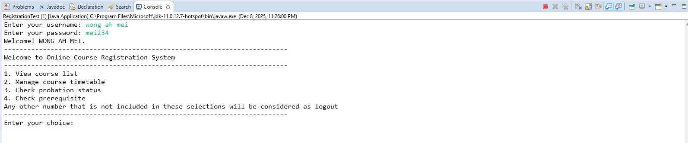

# University Course Registration System 📚

## 📄 Project Overview
A desktop application developed in Java to manage university course enrollment. The project served as a deep dive into **Object-Oriented Programming (OOP)** principles, secure authentication, and structured data handling.

## 🏗 Key Features
* **User Authentication:** Secure login and role-based access for students and administrators.
* **Enrollment Restrictions:** Implemented logic to prevent timetable conflicts and manage course capacity limits.
* **Course & Timetable Management:** Functions for creating, updating, and viewing available courses and student schedules.
* **Data Persistence:** Managed system and enrollment data securely using structured text files.

## 🛠 Technologies
* **Language:** Java
* **Methodology:** Object-Oriented Programming (OOP)
* **Data Storage:** Text Files
